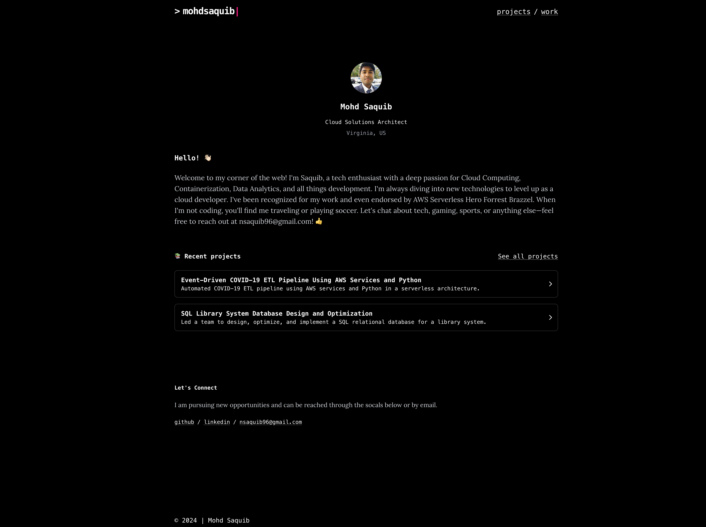

# 🌟 mohdsaquib.com | A blog site using Astro



This project is a static website built with modern tools like [Astro](https://astro.build/), [Tailwind CSS](https://tailwindcss.com/), and [TypeScript](https://www.typescriptlang.org/). It's designed to be fast, responsive, and scalable! 🚀

## ✨ Features

- **Astro** ⚡️ – A modern static site generator for building fast websites.
- **Tailwind CSS** 🎨 – Utility-first CSS for rapid UI development.
- **TypeScript** 🔐 – Ensures type safety in JavaScript code.

## 🛠 Setup

1. **Clone the repository**:

    ```bash
    git clone https://github.com/your-username/your-repo.git
    cd repo
    ```

2. **Install dependencies**:

    ```bash
    npm install
    ```

3. **Run the development server**:

    ```bash
    npm run dev
    ```

4. **Build for production**:

    ```bash
    npm run build
    ```

## 🚀 Deployment

This site is hosted as a static website on **AWS S3**, with a robust CDN and domain management setup:

- **CloudFront**: For lightning-fast content delivery across the globe.
- **Route 53**: Manages domain routing and DNS.
- **ACM (AWS Certificate Manager)**: Ensures secure connections with SSL/TLS certificates.

### 🧑‍💻 CI/CD Pipeline (Coming Soon)

A CI/CD pipeline using **Jenkins** is under development. Once complete, it will automatically build and push updates to **S3** whenever changes are made. Stay tuned! ⚙️

## 📝 License

This project is licensed under the **MIT License**. See the [LICENSE](LICENSE) file for details.

---

🌐 Feel free to report issues, or provide feedback! Let's build something great together. 💡