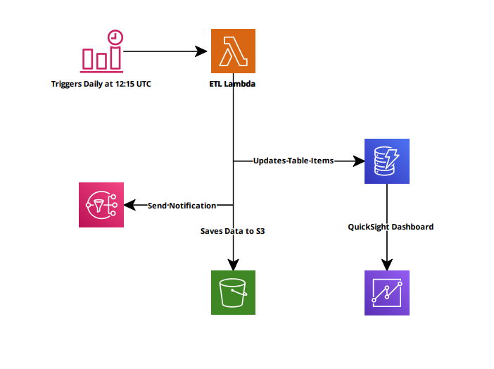
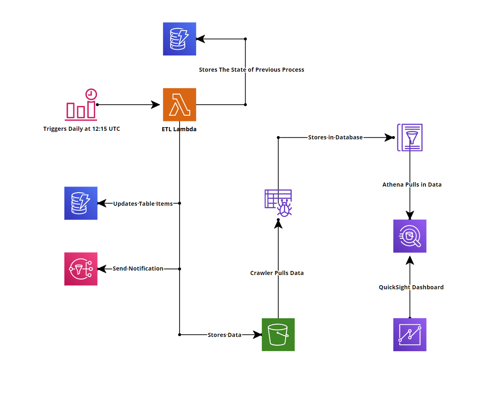
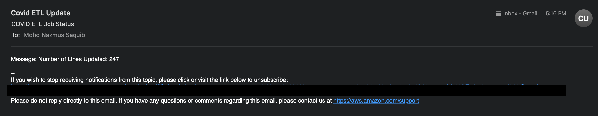
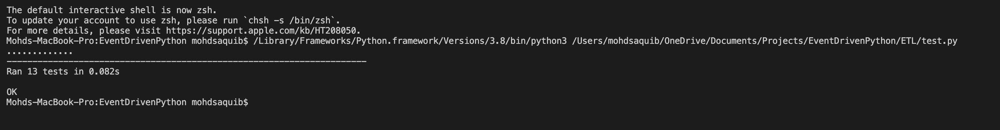
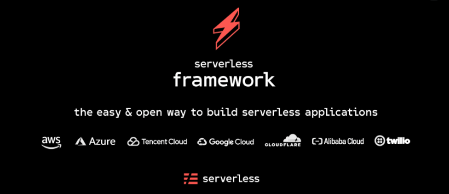
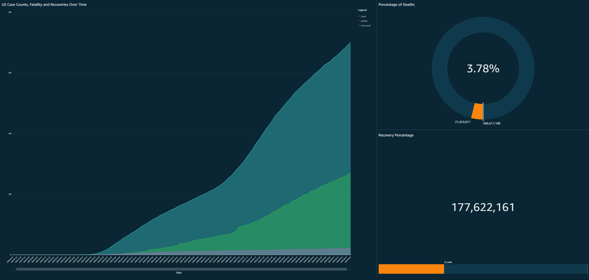

After earning my AWS SAA certification, I was eager to apply my skills in real-world projects. So, when I came across a challenge from A Cloud Guru, I jumped in without hesitation. The past few weeks have been a blend of fun and learning as I worked on this project, and I'm excited to share the experience.

The goal was to build an ETL (Extract, Transform, Load) pipeline for COVID-19 data, sourced from The New York Times and John Hopkins University. Using Python and several AWS services, I built a solution that automates the collection, processing, and storage of this data.

## AWS Services Used:
- S3 Bucket
- Glue Crawler
- Glue Database
- IAM Roles
- DynamoDB
- EventBridge
- Lambda
- CloudWatch
- SNS

## Tech Stack:
- Python
- Pandas
- AWS
- The Serverless Framework
- Github

## Initial Design and Final Architecture
Before diving into the code, I visualized the project architecture to ensure I had a clear strategy. Below is my initial infrastructure mockup, followed by the final architecture diagram.

*Initial Infrastructure Architecture*

*Final Infrastructure Architecture*

## ETL Job Automation
A key part of this project was to automate daily data retrieval. I used Amazon EventBridge (formerly known as CloudWatch Events) to schedule a cron job at 12:15 UTC each day. This feature was straightforward but was implemented later in the development process once the core Lambda functions were ready.

## Extraction Process
The first task was to write a Lambda function in Python to fetch COVID-19 data from The New York Times and John Hopkins University. Using Pandas, I downloaded and stored the data in memory, keeping it in a DataFrame for easy manipulation.

## Data Transformation
During transformation, I converted date fields into proper Date objects and combined the datasets with an inner join on the date field using Pandas. I also filtered out non-US data from the John Hopkins dataset.

While processing, I encountered several missing values `NaN`. I handled these using the Pandas `fillna()` method to replace missing values with zeros. Initially, I designed the project to store data in an S3 bucket before triggering a transformation, but this workflow proved inefficient. Eventually, I modularized the transformation code, making it reusable across the project.

## Data Loading
For storage, I chose DynamoDB, a fast and scalable NoSQL database. Using Boto3, I handled data read, write, and update operations, ensuring the process didn’t overwrite existing entries by checking the partition key.

To improve error handling, I validated date fields and ensured other fields had appropriate values (integers >= 0). If an error occurred, the data was saved in an S3 bucket, and an SNS notification alerted me to the issue. SNS also provided notifications for successful updates, including the number of rows processed.

I also implemented a backup system with an additional DynamoDB table to track process status. If the process failed, it would be flagged, and during the next run, the function would prioritize fixing the old data before processing new data.

## Writing Tests
To ensure reliability, I wrote tests using Python’s built-in `unittest` module. This was my first time writing tests, and after some initial learning, I found it quite easy to implement. These tests helped identify issues when updating the main functions, and I used custom test data to validate my code.

## Infrastructure as Code (IaC)
This project was fully serverless, so there was no need for physical servers. I used the Serverless Framework to define my infrastructure. The Serverless Framework is gaining popularity as cloud services grow, and it's incredibly easy to use.

One of the biggest advantages of Serverless is its simplicity in managing infrastructure. With just a few commands, I could deploy or remove the entire setup. This also made it easy to package Python dependencies and use third-party integrations via the `serverless.yml` file, which functions similarly to AWS CloudFormation with added benefits.

## Building the Dashboard
Creating a dashboard turned out to be the most challenging part of this project. Initially, I intended to use AWS QuickSight to visualize the data. However, I quickly learned that QuickSight doesn’t support DynamoDB. After some research, I found that QuickSight integrates well with Amazon Athena.

I restructured my workflow by saving the processed data in an S3 bucket. Then, I set up AWS Glue Crawler to load the data into an AWS Glue Database. From there, the data flowed seamlessly into Athena, allowing me to visualize it in QuickSight.

## Conclusion
This project was an exciting and educational experience, offering valuable insights into AWS services and Python programming. Working with the Serverless Framework has been a highlight—it's intuitive and simplifies cloud infrastructure development.

For anyone looking to strengthen their AWS and Python skills, I highly recommend taking on a similar project. You’ll not only gain hands-on experience with key AWS services but also expand your knowledge of serverless architecture.

I'm eager to tackle future challenges from A Cloud Guru and explore even more cloud technologies!