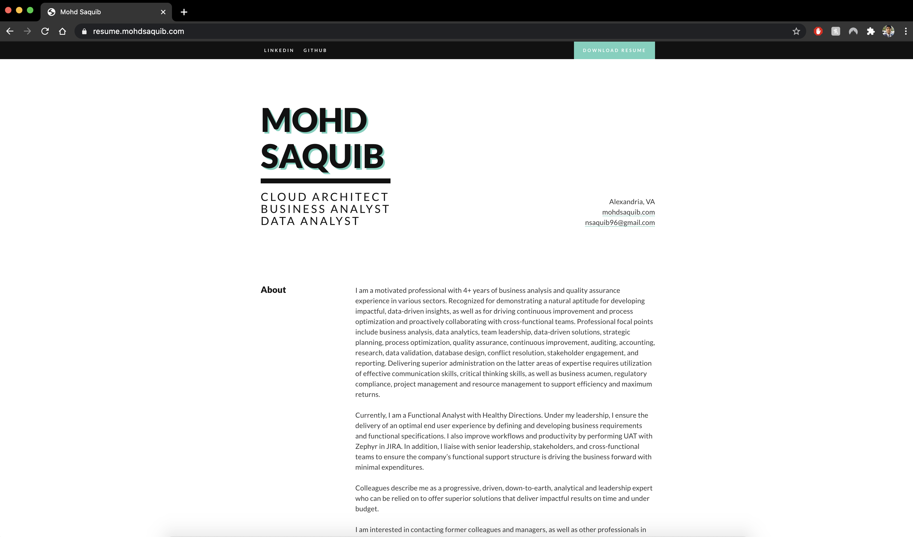
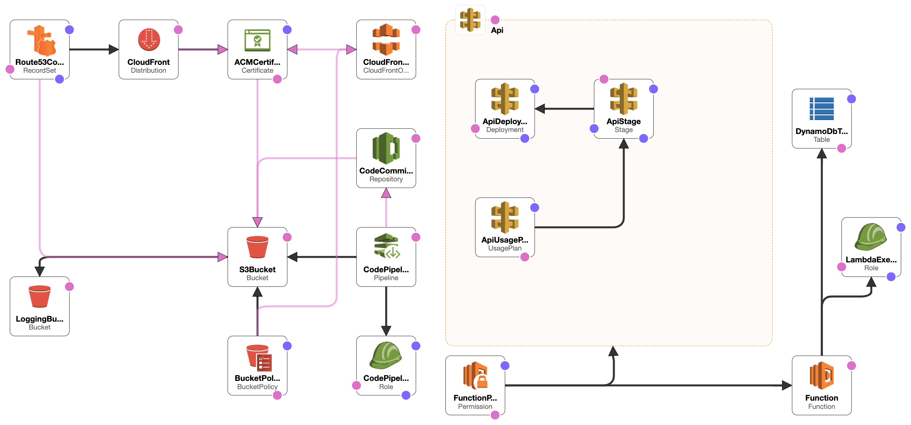
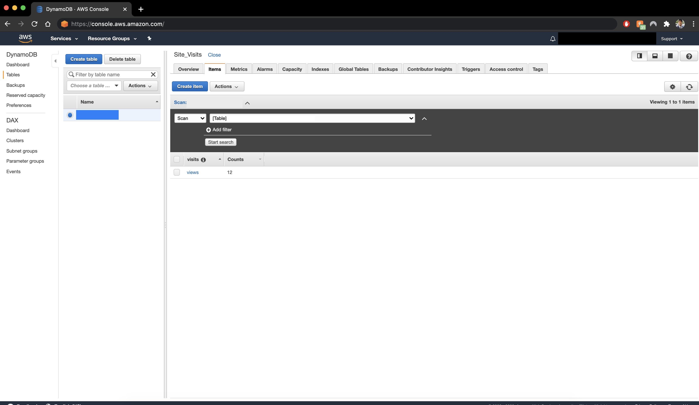
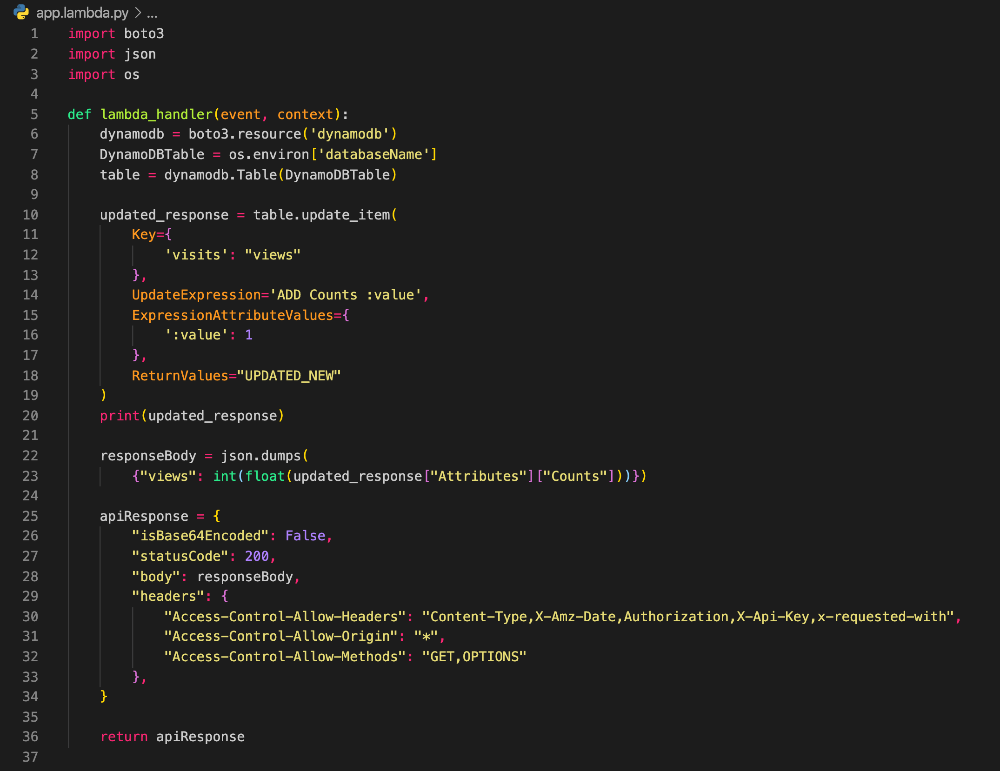
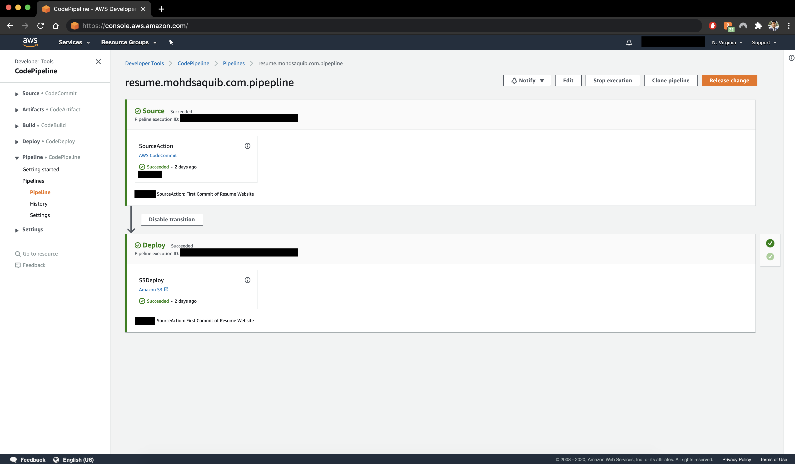
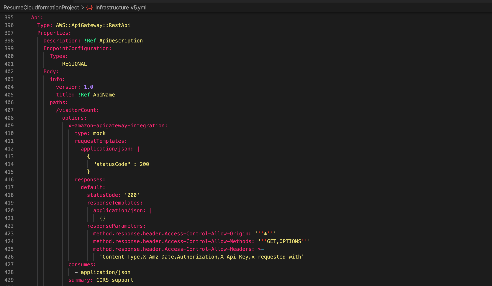
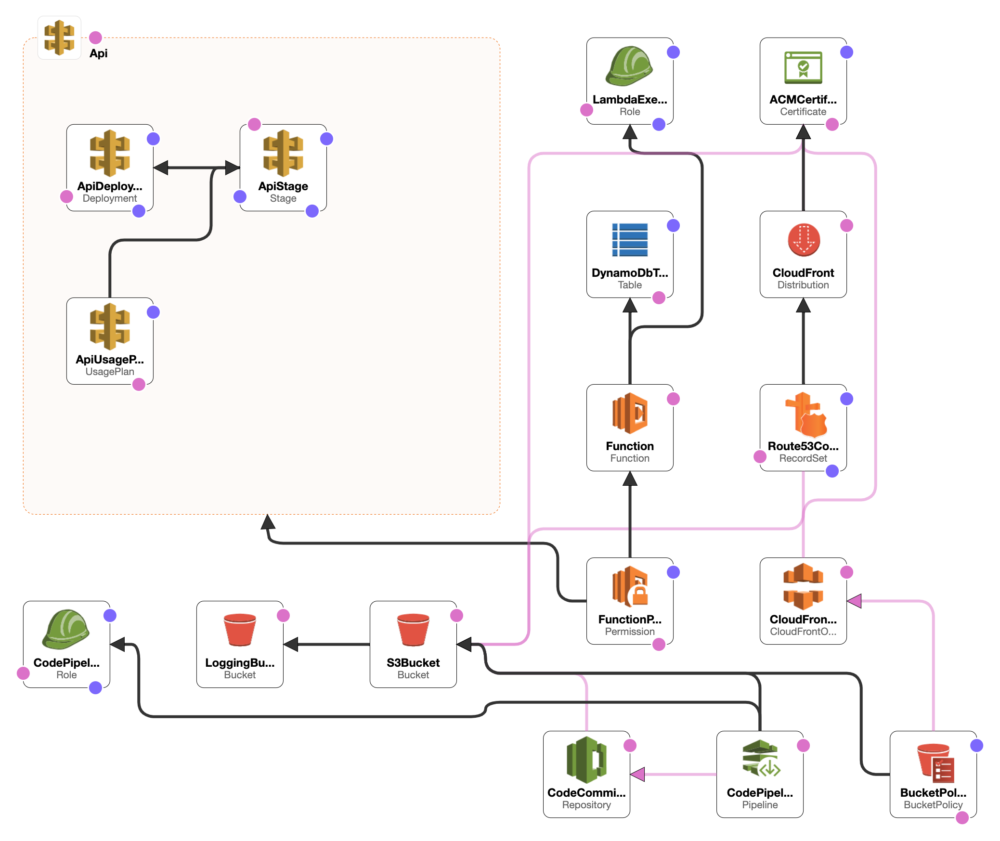

## Overview

In this project, I demonstrate how to build a **serverless resume website** using AWS services such as **S3**, **Lambda**, **DynamoDB**, **API Gateway**, and **CloudFormation**. This step-by-step guide illustrates how to create a scalable, secure, and serverless website that tracks user visits using AWS's cloud-native solutions. 

The motivation for this project came after achieving my AWS certification, where I aimed to apply my knowledge practically by developing a project that could showcase my skills. A key takeaway from this project is how various **AWS services** can work together to create a dynamic website, without the need for traditional servers.

## Project Goals

The primary goals for this project were:
1. Build and deploy a **serverless resume website** using **AWS S3** for website hosting.
2. Implement a **real-time visitor counter** using **AWS Lambda**, **DynamoDB**, and **API Gateway**.
3. Automate infrastructure deployment and management using **AWS CloudFormation** and **CodePipeline**.
4. Ensure the website is secure and fast by integrating **CloudFront** and **SSL certificates** from **AWS Certificate Manager (ACM)**.

By the end of this project, I had a fully functioning resume website that was **cost-efficient**, **scalable**, and **serverless**.

## Frontend Development: Setting Up the Website

### Creating the Static Website

The frontend for this project was built using basic **HTML**, **CSS**, and **JavaScript**. I started by using a resume template from CodePen, then customized the sections and integrated **JavaScript** to fetch data from my **API Gateway** to display the number of visitors. This project focused more on backend services, so the frontend was kept simple but functional.

### Hosting the Website on AWS S3

For hosting, I used **Amazon S3** to store and serve the static files. By enabling **S3 bucket versioning**, I ensured that every update to the site could be tracked, and **logging** was enabled for security audits.

- **S3 Website Hosting**: To host the website, I enabled the static website hosting feature on the S3 bucket. This allowed me to serve the static files directly from S3.

- **Custom Domain Setup**: Instead of using the default S3-generated URL, I purchased a custom domain through **AWS Route 53** and linked it to my S3 bucket. This setup allowed me to serve the website using a more professional-looking domain name.

- **SSL and Security with CloudFront**: To enhance the security of the website, I set up **AWS CloudFront**, a global **Content Delivery Network (CDN)**, which serves the website from **edge locations** around the world, reducing latency. CloudFront also provided an extra layer of security by using **AWS Shield**, which protects against Distributed Denial of Service (DDoS) attacks. I configured **Origin Access Identity (OAI)**, ensuring that the content in my S3 bucket could only be accessed through CloudFront, enhancing the security of my web assets.

By integrating **AWS ACM** for SSL certificates, the site was secured with HTTPS, making it trustworthy for visitors.

## Backend Development: Implementing the Visitor Counter

One of the core features of the website was a **serverless visitor counter**. Here’s how I approached it:

### Step 1: Designing the DynamoDB Table

For the visitor counter, I used **Amazon DynamoDB**, a NoSQL database service. I designed a table with a simple schema to store the visitor count. Each time the page is visited, the counter is incremented.

- **Table Design**: The table had a single item with an attribute representing the visitor count. This design minimized complexity while ensuring fast read/write operations.

### Step 2: Building the Lambda Function

Next, I built an **AWS Lambda function** to handle the logic of updating the visitor counter. The Lambda function would be triggered by an API request and would update the count in DynamoDB.

- **Lambda Setup**: I wrote the Lambda function in Node.js, using the **AWS SDK** to interact with DynamoDB. The function would retrieve the current count, increment it, and store the updated value back in DynamoDB.

- **Challenges and Solutions**: Initially, I faced issues with CORS and data formatting, which prevented the function from returning data properly. After extensive debugging, I realized the output needed to be in **JSON format** with the appropriate **CORS headers** to resolve the issue.

### Step 3: API Gateway for HTTP Requests

To expose the Lambda function to the public, I used **AWS API Gateway**, which allowed users to trigger the Lambda function via a REST API.

- **API Gateway Setup**: I configured an **HTTP API** in API Gateway to forward incoming requests to the Lambda function. API Gateway also handled authentication, rate limiting, and CORS settings to ensure secure communication between the frontend and the backend.

After multiple iterations and refinements, the visitor counter was working perfectly, incrementing with each page visit and displaying the count in real time on the website.

## Automating the Process: Continuous Deployment with AWS CodePipeline

Manually uploading changes to the S3 bucket every time I updated the website became tedious, so I automated the deployment process using **AWS CodePipeline**.

- **CodeCommit for Version Control**: I used **AWS CodeCommit** to store my website’s code. This provided a centralized repository for tracking changes.

- **CodeDeploy and CodePipeline**: I integrated **CodeDeploy** and **CodePipeline** to automate the deployment process. Now, every time I pushed updates to CodeCommit, the pipeline would automatically deploy the new version to the S3 bucket within seconds.

## Infrastructure as Code: CloudFormation Automation

A major part of this project was learning to implement **Infrastructure as Code (IaC)** using **AWS CloudFormation**. CloudFormation made it easy to automate the deployment of all resources—S3, Lambda, DynamoDB, API Gateway, and more—through a single YAML configuration file.

### CloudFormation Stack Components

- **S3 Bucket**: Hosted the website files.
- **Lambda Function**: Managed visitor count logic.
- **DynamoDB Table**: Stored visitor count data.
- **API Gateway**: Connected frontend to backend.
- **CloudFront**: Improved security and performance.
- **Route 53**: Managed DNS and domain routing.

CloudFormation allowed me to easily recreate the entire infrastructure by running a simple command, making the process highly efficient and repeatable.

## Final Thoughts and Future Plans

Working on this project was a rewarding experience that enhanced my understanding of serverless architecture, AWS services, and cloud automation. The website now runs without any servers, scales automatically, and incurs minimal operational costs. I’m excited to continue exploring serverless solutions and plan to build more cloud-based projects using **CloudFormation** and **AWS Lambda**.

Next, I aim to develop a **multi-tier serverless application**, entirely managed with **CloudFormation**, to deepen my cloud expertise and further automate processes.

