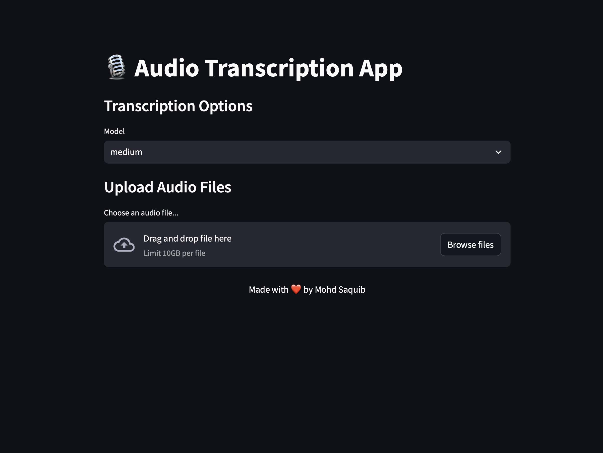

## Overview

Building a Fast and Efficient Audio Transcription App with Whisper
I recently started a project to develop an audio transcription app to accurately transcribe uploaded audio files. I decided to use OpenAI's Whisper model for transcription because of its performance in speech recognition. To create a user-friendly interface quickly, I chose to use Streamlit, which enabled me to develop the app faster and more efficiently compared to traditional web frameworks.

In this blog post, I'll walk you through the code, explaining my decision-making process and how each component contributes to the app's overall functionality.

## Why Streamlit?

Before diving into the code, let's discuss why I chose Streamlit. Streamlit is an open-source Python library that empowers you to create and share beautiful web apps with ease. It allows for straightforward development without needing in-depth web development knowledge. This made it the perfect choice for this project, as I wanted to concentrate on the transcription functionality without being burdened by front-end development.

## Setting Up the Environment

The following libraries were used in this project:

- **streamlit**: For creating the web app.
- **whisper**: OpenAI's Whisper model for transcription.
- **torch**: Required by Whisper for GPU processing.
- **logging**: To keep track of events and errors.

## Configuring Logging

I set up logging to monitor the application's behavior to help debug and track each transcription's duration.

```python
logging.basicConfig(level=logging.INFO, format='%(asctime)s - %(levelname)s - %(message)s')
logger = logging.getLogger()

```

## Loading the Whisper Model and Utilizing GPU for performance

I added caching using Streamlit's `@cache` decorator to improve the application's performance. This will reduce the time needed to download the models from OpenAI's repository. Additionally, this part of the code checks if a GPU is available; if not, it will use the CPU instead.

```python
@st.cache_resource
def load_model(model_size):
    device = "cuda" if torch.cuda.is_available() else "cpu"
    logger.info(f"Loading model: {model_size} on {device}")
    return whisper.load_model(model_size, device=device)
```

## Transcribing Audio Files

The core functionality is contained within the transcribe_audio function. This function parses the what needs to be done using the audio files. It also sets the default language to English to optimize the transcription for English audio and Tracks the start and completion of each transcription.

```python
def transcribe_audio(model, audio_path):
    device = "cuda" if torch.cuda.is_available() else "cpu"
    language = "en"
    logger.info(f"Transcribing audio file: {audio_path} in {language} using {device}")
    result = model.transcribe(audio_path, language=language)
    logger.info("Transcription completed")
    return result["text"]
```

## Tracking Transcription Count

I also wanted to keep track of the number of transcriptions performed so far. I like to see data, so I tried to gather as much data as possible that, to me, is beneficial. To do this, I wrote a function that updates the number of times a transcription is performed in a text file.

```python
def get_transcription_count(file_path="transcription_count.txt"):
    if os.path.exists(file_path):
        with open(file_path, "r") as file:
            count = int(file.read())
    else:
        count = 0
    logger.info(f"Current transcription count: {count}")
    return count

def update_transcription_count(count, file_path="transcription_count.txt"):
    with open(file_path, "w") as file:
        file.write(str(count))
    logger.info(f"Updated transcription count: {count}")
```

## Model Selection

I've added a section that puts the power in the end user's hands, allowing them to select the model size they want. This is because sometimes time is more important than accuracy, and I wanted to give the end user the ability to choose different models based on their needs. I've set 'Medium' as the default model since I use this model most of the time. Additionally, as I have mentioned earlier, I've implemented a caching mechanism so that when the app loads up, it doesn't need to download the model every time. Instead, it checks for the cached model and uses it if it exists. If not, it will download the model selected by the user.

```python
model = load_model(model_size)
```

## Handling the Uploaded File

After a recording file is uploaded, the app processes it. This is where I have added another function that tracks the duration of the transcription and provides a visual indicator on the app to show the processing time.

```python
if uploaded_file:
    try:
        # Save the uploaded file temporarily
        temp_audio_path = "temp_audio_file"
        with open(temp_audio_path, "wb") as f:
            f.write(uploaded_file.getbuffer())

        logger.info(f"Uploaded file: {uploaded_file.name}")

        # Measure transcription time
        start_time = time.time()

        # Transcribe the audio file
        with st.spinner(f"Transcribing {uploaded_file.name}..."):
            transcription = transcribe_audio(model, temp_audio_path)

        end_time = time.time()
        transcription_time = end_time - start_time

        # Update transcription count
        count = get_transcription_count()
        count += 1
        update_transcription_count(count)
```

## Displaying Results

Once the transcription is complete, the app displays an audio player along with the transcription. Users then can decide to save transcription in a text file to their machine using a download button.

```python
# Audio Player
st.audio(temp_audio_path, format="audio/wav")
# Display the transcription
st.subheader(f"Transcription Result for {uploaded_file.name}")
st.text_area("Transcription:", transcription, height=200)
st.write(f"**Transcription Time:** {transcription_time:.2f} seconds")
st.write(f"**Transcription Length:** {len(transcription)} characters")


# Save the transcript
output_file_name = os.path.splitext(uploaded_file.name)[0] + ".txt"
output_dir = "./transcripts/"
output_path = os.path.join(output_dir, output_file_name)

os.makedirs(output_dir, exist_ok=True)
with open(output_path, "w") as file:
    file.write(transcription)

logger.info(f"Transcription saved to {output_path}")

st.success(f"Transcription of {uploaded_file.name} completed and saved!", icon="✅")

# Download link
with open(output_path, "rb") as file:
    btn = st.download_button(
        label="Download Transcription",
        data=file,
        file_name=output_file_name,
        mime="text/plain"
    )
```

## Error Handling

I added a try-except block to catch any errors throughout the entire code, ensuring a smooth experience and peace of mind during the transcription.

```python
except Exception as e:
    logger.error(f"An error occurred while transcribing {uploaded_file.name}: {str(e)}")
    st.error(f"An error occurred while transcribing {uploaded_file.name}: {str(e)}")
```

## Conclusion

Streamlit's simplicity allowed me to focus on the core functionality without worrying about the complexities of web development. Integrating OpenAI's Whisper model provides high-quality transcriptions, making this tool powerful and user-friendly. The best part of this app is that everything is done on the local machine, so your data is not sent to any data center for processing; it is transcribed on your servers. If you have a GPU, you will experience faster processing times. However, if a GPU is unavailable, the app can still work on a CPU; just select the appropriate whisper model.
